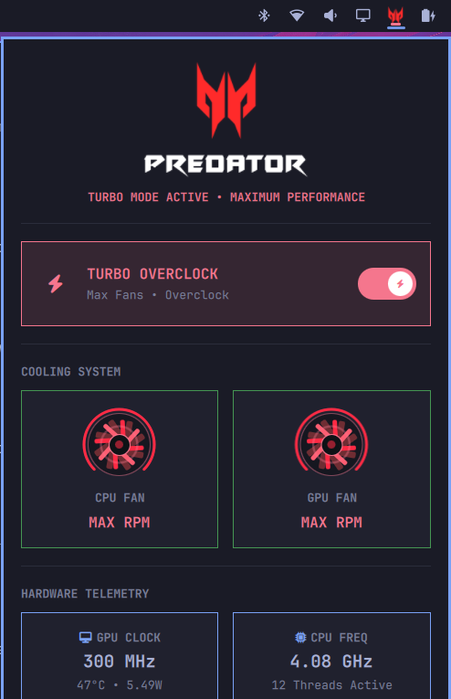

<p align="center">
  
</p>

# Omarchy Predator Turbo Plugin (`predator-turbo`)

A native, first-class **Omarchy (Quickshell)** bar widget and interactive hardware control center for **Acer Predator Helios 300 (PH315-52)** and related Acer Predator gaming laptops.

Created with ❤️ by **Aniket B. ([@Aniket1995](https://github.com/Aniket1995))**.



---

## ✨ Features

- **Centered Status Bar Widget:** Pure white Predator logo matching Omarchy's bar iconography, dynamically igniting into fierce **Predator Red** when Turbo mode is engaged.
- **Hardware Turbo Toggle:** Modern animated capsule pill switch providing instantaneous Overclock & Fan Max switching.
- **Cyberpunk Jet-Turbine Cooling Bay:** Dual-layer aerodynamic turbine rotor running at 60fps GPU acceleration, 270° radial tachometer arc gauge, and pulsating core with radiant heat-flare shockwaves under Turbo.
- **Live Fan RPM:** Real-time RPM telemetry for both CPU and GPU cooling fans.
- **Hardware Telemetry:** Live GPU clock (MHz), GPU temp, memory clock, power draw, and CPU frequency (GHz).

---

## 🚀 Installation

Install directly with Omarchy's plugin manager:

```bash
omarchy plugin add https://github.com/Aniket1995/omarchy-predator-turbo.git --enable
```

To update in the future:
```bash
omarchy plugin update predator-turbo
```

---

## 🗑️ Removal

To disable and remove the plugin from Omarchy:

```bash
omarchy plugin remove predator-turbo
```

---

## 📋 Prerequisites

This plugin communicates with `/sys/devices/platform/acer-wmi/turbo_mode` and `/sys/class/hwmon/`. Ensure the `facer` DKMS module or an ACPI driver providing this interface is active on your Predator laptop.

---

## 🎖️ Acknowledgements & Citations

- **Kernel Module Driver & WMI Reverse-Engineering:**  
  Massive thanks and full credit to **Jafar Akhondali** ([@JafarAkhondali](https://github.com/JafarAkhondali)) for developing the open-source [`acer-predator-turbo-and-rgb-keyboard-linux-module`](https://github.com/JafarAkhondali/acer-predator-turbo-and-rgb-keyboard-linux-module) (`facer`) driver that reverse-engineered Acer's proprietary ACPI-WMI gaming method calls for Linux.
- **Omarchy Shell Plugin:**  
  Conceived, designed, and developed by **Aniket B.** for the [Omarchy](https://github.com/basecamp/omarchy) ecosystem.

---

## 📄 License

MIT License © 2026 Aniket B.
